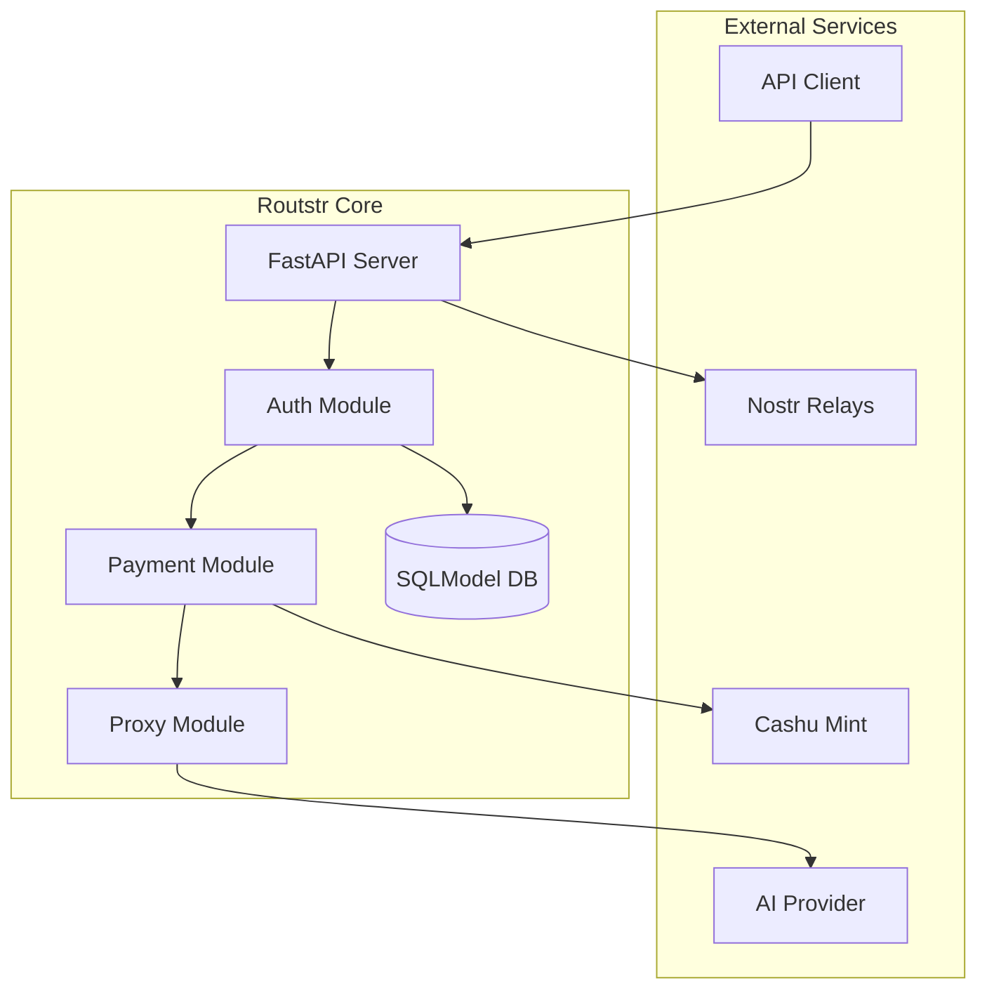
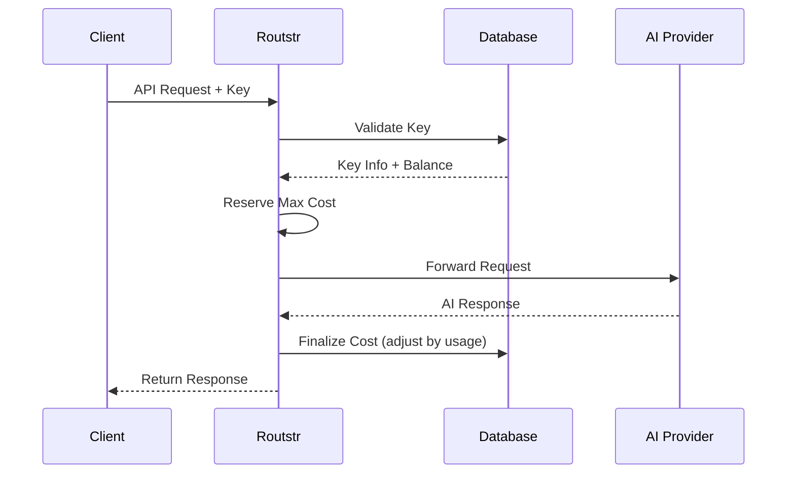
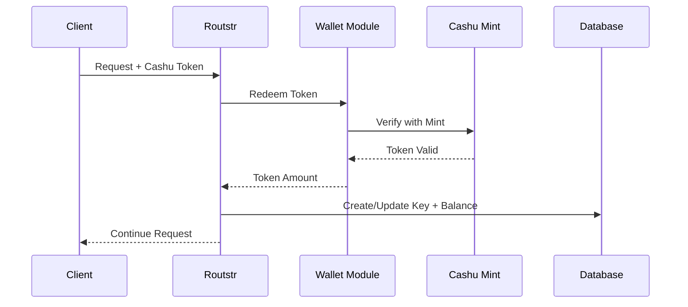

# Architecture Overview

This document describes the high-level architecture of Routstr Core, helping contributors understand how the system works.

## System Overview

Routstr Core is a FastAPI-based reverse proxy that adds Bitcoin micropayments to OpenAI-compatible APIs and can optionally announce providers via Nostr.



## Core Components

### FastAPI Application

The main application is initialized in `routstr/core/main.py`:

- **Lifespan Management**: Runs migrations, initializes DB, refreshes pricing/models, starts background tasks
- **Middleware**: CORS and request logging
- **Routers**: Admin, pricing/models, balance/wallet, providers discovery, proxy
- **Background Tasks**: Price refresh, model map refresh, payouts, node announcements, provider discovery refresh

### Authentication System

Located in `routstr/auth.py`, handles:

- **API Key Validation**: SHA-256 hashed key lookup and persistence
- **Balance Checking**: Ensures sufficient funds before requests
- **Token Redemption**: Converts Cashu tokens to balance

### Payment Processing

The `routstr/payment/` module manages:

- **Cost Calculation**: Token-based or fixed pricing
- **Model Pricing**: Derived from upstream providers and DB overrides
- **Currency Conversion**: BTC/USD price refresh and conversion
- **Fee Application**: Provider fee applied to upstream model pricing

### Request Proxying

`routstr/proxy.py` handles:

- **Request Forwarding**: Forwards requests to selected upstream providers
- **Response Streaming**: Streaming and non-streaming paths
- **Usage Tracking**: Adjusts costs after upstream responses
- **Error Handling**: Maps upstream errors to consistent responses

### Database Layer

Using SQLModel in `routstr/core/db.py`:

```python
# Core tables
ApiKey:
  - hashed_key: Primary key (SHA-256 of key or Cashu token)
  - balance: Current balance (msats)
  - reserved_balance: Reserved balance (msats)
  - refund_address: Optional LNURL for refunds
  - key_expiry_time: Optional refund expiry timestamp
  - total_spent: Total spent (msats)
  - total_requests: Request count
  - refund_mint_url: Mint URL for refunds
  - refund_currency: Refund currency

UpstreamProviderRow:
  - id: Primary key
  - provider_type: openai/anthropic/azure/openrouter/etc.
  - base_url: Provider API base URL
  - api_key: Provider API key
  - api_version: Optional API version
  - enabled: Provider enabled flag
  - provider_fee: Provider fee multiplier

ModelRow:
  - id: Model ID
  - upstream_provider_id: Provider foreign key
  - name: Model name
  - architecture: JSON
  - pricing: JSON
  - sats_pricing: JSON
  - per_request_limits: JSON
  - top_provider: JSON
  - canonical_slug: Canonical model slug
  - alias_ids: Model aliases
  - enabled: Model enabled flag

LightningInvoice:
  - id: Primary key
  - bolt11: Invoice
  - amount_sats: Amount in sats
  - payment_hash: Payment hash
  - status: pending/paid/expired/cancelled
  - api_key_hash: Optional associated API key
  - purpose: create/topup
  - created_at: Unix timestamp
  - expires_at: Unix timestamp
  - paid_at: Unix timestamp
```

## Request Flow

### Standard API Request



### Payment Flow



## Key Design Decisions

### 1. Async Architecture

The system is async end-to-end, with background tasks for pricing refresh, provider discovery, model map refresh, and payouts.

### 2. Modular Design

Components are loosely coupled:

- **Routers**: Separate files for different endpoints
- **Dependencies**: Injected via FastAPI's DI system
- **Models**: Shared data structures
- **Services**: Business logic separated from routes

### 3. Error Handling

Exceptions are handled by FastAPI exception handlers to return consistent JSON responses with a request ID.

### 4. Database Migrations

Alembic migrations are run on startup, and tables are created for any models not tracked by migrations.

## Security Architecture

### API Key Security

- **Storage**: SHA-256 hashed keys
- **Generation**: Cryptographically secure random (when creating new keys)
- **Validation**: Hash lookup in DB
- **Expiry**: Optional refund flow via `key_expiry_time` and `refund_address`

### Payment Security

- **Token Validation**: Cashu token redemption via mint
- **Balance Protection**: Atomic updates and reserved balance tracking
- **Audit Trail**: Structured logging of payments and adjustments

### Network Security

- **CORS**: Configurable origins
- **Input Validation**: Pydantic models

## Performance Considerations

### Caching Strategy

Model and provider selections are cached in process memory and refreshed on a schedule.

### Database Optimization

- **Async I/O**: Non-blocking queries
- **Atomic Updates**: Balance reservation and finalization updates

### Streaming Responses

Streaming responses are forwarded from upstream providers with usage tracking hooks.

## Extension Points

### Adding New Endpoints

1. Create router module
2. Define Pydantic models
3. Implement business logic
4. Register with main app
5. Add tests

### Custom Pricing Models

1. Extend `ModelPrice` class
2. Implement calculation logic
3. Add to pricing registry
4. Update configuration

### Payment Methods

1. Create payment handler
2. Implement validation
3. Add to payment router
4. Update balance logic

## Testing Strategy

### Unit Tests

- Mock external dependencies
- Test business logic in isolation

### Integration Tests

- Test component interactions
- Use test database
- Mock external services
- Verify end-to-end flows

### Performance Tests

- Response time benchmarks (as needed)

## Monitoring and Observability

### Structured Logging

```python
logger.info("api_request", extra={
    "request_id": request_id,
    "api_key": api_key_id,
    "endpoint": endpoint,
    "model": model,
    "tokens": token_count,
    "cost_sats": cost,
    "duration_ms": duration
})
```

### Metrics Collection

Structured logs are emitted for requests, pricing, and payment events.

### Health Checks

Use `/v1/info` for basic service metadata and configuration visibility.

## Deployment Architecture

### Container Structure

See `core/Dockerfile` for the current container build configuration.

### Environment Configuration

- **Development**: Local SQLite, debug logging
- **Testing**: In-memory database, mock services
- **Production**: Persistent storage, structured logs

### Scaling Considerations

- **Horizontal**: Multiple instances behind a load balancer
- **Vertical**: Async handles high concurrency
- **Database**: Configure `DATABASE_URL` for external databases

## Future Architecture

### Planned Improvements

1. **WebSocket Support**: Real-time balance updates
2. **Plugin System**: Extensible pricing/auth
3. **Multi-Region**: Geographic distribution
4. **Event Sourcing**: Complete audit trail

### Technical Debt

Areas for improvement:

- Database query optimization
- Response caching layer
- Metric aggregation
- API versioning strategy

## Next Steps

- Review [Code Structure](code-structure.md) for detailed organization
- See [Testing Guide](testing.md) for test architecture
