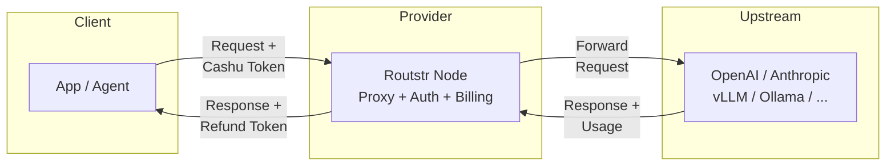

# Overview

Routstr is a decentralized protocol for **permissionless, private, and censorship-resistant AI inference**. It creates an open marketplace where anyone can sell llm-tokens and anyone can buy them using privacy-preserving micropayments.

By combining **Nostr** (for censorship-resistant discovery and communication) and **Cashu** (for private, instant Bitcoin eCash payments), Routstr effectively removes the "middleman" from the AI ecosystem.

## How it Works

The network consists of independent **Providers** (Sellers) and **Clients** (Buyers). There is no central server, no login, and no credit card required.

1. **Discovery (Nostr)**: Providers announce their availability, models (e.g., `gpt-4o`, `deepseek-r1`), and prices on the Nostr network.
2. **Payment (Cashu)**: Clients pay providers directly using Bitcoin eCash (Cashu tokens). These payments are untraceable and settle instantly.
3. **Inference (Proxy)**: The Provider acts as a gateway (or runs local hardware), executing the AI model and returning the result to the Client.

## Who is this for?

The documentation is split into two paths depending on your goal:

### 🐣 I want to BUILD on Routstr (Client)

You are a developer building an AI agent, a chat app, or a script, and you want access to AI models without API keys, subscriptions, or KYC.

* **No Accounts**: Just get a wallet.
* **Privacy**: Your requests are mixed with thousands of others; providers can't profile you.
* **Choice**: Switch between hundreds of providers instantly for the best price/performance.

👉 **[Go to Client Guide](client/introduction.md)**

### 🦁 I want to RUN a Node (Provider)

You have API credits (OpenAI, Anthropic, etc.) or GPU capacity and want to earn Bitcoin by selling AI access to the network.

* **Monetize API Keys**: Connect your OpenAI/Anthropic/OpenRouter accounts and earn sats on every request.
* **Monetize Hardware**: Run local models (via vLLM, Ollama) and sell access.
* **Permissionless**: No approval needed. Start the container, configure via dashboard, start earning.

!!! note "Coming Soon"
    Future versions will support node-to-node routing—run a gateway without needing your own AI provider credentials.

👉 **[Go to Provider Guide](provider/quickstart.md)**

---

## Architecture

Routstr is built on a modular stack defined by the [Routstr Improvement Protocols (RIPs)](https://github.com/routstr/rips).

## Why Routstr?

| Feature | Closed AI | Routstr |
| :--- | :--- | :--- |
| **Access** | Account, KYC, Credit Card | Permissionless, Bitcoin-native |
| **Privacy** | Full Logging & Tracking | Blinded Payments, Ephemeral Sessions |
| **Resilience** | Single Point of Failure | Decentralized Network |
| **Pricing** | Fixed, Monopolistic | Dynamic, Market-driven |
| **Global** | Geofenced | Borderless (Tor/I2P supported) |
