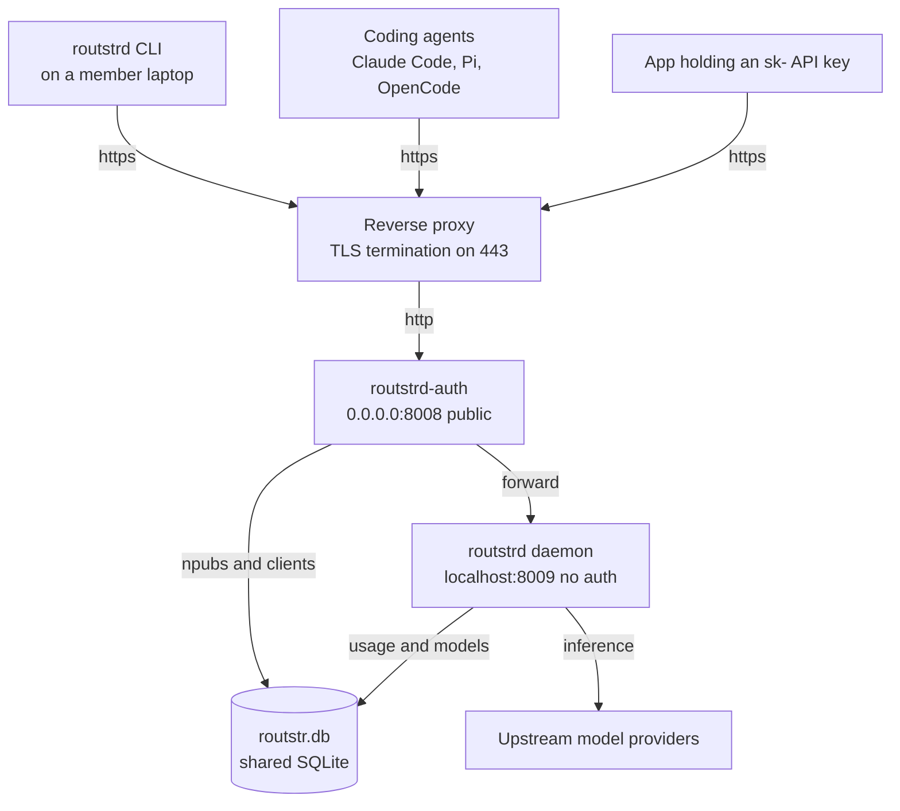

# Teams and Remote Nodes

A normal `routstrd` install is a **single-user daemon** running on your own machine. A **remote node** turns that same daemon into a **shared instance for a team**: one server runs the daemon behind an authentication proxy, and every team member gets their own Nostr identity, their own API keys, and their own usage accounting.

This is the product sometimes called **Routstrd Remote** — the repository is [`Routstr/routstrd-remote`](https://github.com/routstr/routstrd-remote) and the running service is the package `routstrd-auth`.

---

## Who this is for

- **Small teams and orgs** that want one funded Routstr endpoint instead of one daemon per laptop.
- **Anyone who wants per-person spend visibility** without building a billing system.
- **Self-hosters** who already run [Cloudron](https://www.cloudron.io/) and want a one-click install.

## What it gives you

| Capability | Detail |
|---|---|
| **One endpoint, many people** | Members point their coding agents at a single HTTPS URL. No per-machine setup beyond one CLI command. |
| **Per-member identity** | Each person has their own Nostr keypair (npub). Access is granted and revoked by adding or deleting that npub. |
| **Per-member attribution** | Every client registration gets a unique ID, and usage is reported per client, so you can see who is spending what. |
| **Two levels of privilege** | `admin` (manage people, move funds, control the node) and `user` (run inference, manage only their own clients). |
| **Scoped API keys** | Agent API keys can buy inference but cannot touch the wallet or other members' clients. |
| **Model policy** | Optional allowlist restricts the team to approved models. |
| **One wallet to fund** | The team tops up a single node wallet rather than N personal wallets. |

## What it is not

- It is **not** multi-tenant SaaS. Everyone shares the node's wallet and upstream provider set.
- It is **not** a billing or chargeback system. Usage is *attributed* per client; invoicing your teammates is up to you.
- It does **not** give each member a separate balance. See [Usage and Model Policy](usage-and-policy.md) for exactly what is tracked.

---

## Architecture

Two processes run together inside one container. Only one of them is reachable from outside.

**The security property that matters:** the daemon runs with **no authentication at all** because it is bound to `localhost` and never published. The auth proxy is the only public surface. If you expose port `8009`, you have removed the entire security model.

### Components

| Component | Role | Bind |
|---|---|---|
| `routstrd-auth` | Public auth proxy. Validates credentials, enforces roles and model policy, forwards to the daemon. | `0.0.0.0:8008` |
| `routstrd` | The inference daemon. Owns the wallet, providers, clients, and usage records. | `localhost:8009` |
| `routstr.db` | Shared SQLite database. Holds `routstr_auth_npubs`, `clients`, usage rows, and `sdk_storage` (including the Routstr 21 model list). | on disk |
| Reverse proxy | TLS termination and the public hostname. On Cloudron this is managed by the platform. | `443` |

---

## Roles

Registration lives in a single table, `routstr_auth_npubs`, where each row has a `role` of `admin` or `user`.

| Capability | `admin` | `user` |
|---|---|---|
| Run inference with own API keys | yes | yes |
| Create and delete **own** clients | yes | yes |
| Read **own** usage | yes | yes |
| List all registered npubs | yes | yes |
| Add / update / delete npubs | yes | no |
| Send funds from the node wallet | yes | no |
| Node control (providers, refunds, stop) | yes | yes |
| Read wallet balance / status | yes | yes |

`user` is the default role when an admin adds someone. Promote with `routstrd npubs update <npub> --role admin`.

---

## Bootstrap order

A fresh node has an empty npub table. That produces exactly one unaudited window, and only one:

1. **The first person** runs `routstrd npubs register` against the new node. Because the table is empty, `POST /npubs` is accepted **without authentication**, and the caller becomes `admin`.
2. From that moment on, **every** npub operation requires NIP-98 auth from an existing admin. A second unauthenticated registration is refused with `409` / "already configured".

Nobody else can self-register. Team members must be added by an admin. See [Team Members](team-members.md).

---

## Next steps

- **[Deploy on Cloudron](deploy-cloudron.md)** — the supported, packaged deployment with TLS and backups handled for you.
- **[Deploy with Docker](deploy-docker.md)** — run the same image anywhere, behind your own reverse proxy.
- **[Team Members](team-members.md)** — bootstrap the first admin and invite people.
- **[Connecting Clients](clients.md)** — wire up Claude Code, Pi, OpenCode, and raw API keys.
- **[Usage and Model Policy](usage-and-policy.md)** — per-member spend tracking and the model allowlist.
- **[Security Model](security.md)** — the exact auth rules, public paths, and restricted endpoints.
- **[Troubleshooting](troubleshooting.md)** — diagnosing the failures people actually hit.
