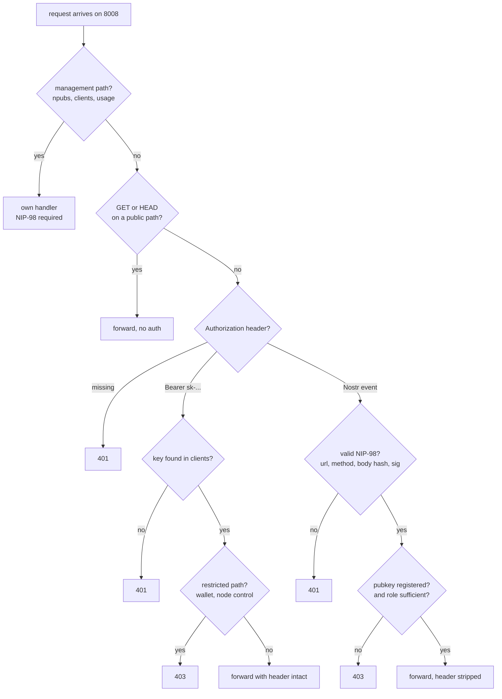

# Security Model

The whole design rests on one property: **the daemon has no authentication because it is never reachable.** `routstrd` binds loopback-only on port `8009`; the auth proxy on `8008` is the single public surface, and it is the only component that makes authorisation decisions.

!!! danger "Never publish port 8009"
    The daemon is unauthenticated by design. Exposing it — or port-forwarding it for debugging, or forgetting to restrict a Docker port mapping to loopback — removes the entire security model at once. Anyone who reaches it can read the wallet, list every member's clients, and spend the team's funds.

---

## Request decision flow

The proxy is **default-deny**. A request is only forwarded if some rule explicitly allows it.



Two details are easy to miss:

- **Public means `GET`/`HEAD` only.** The proxy applies the public-path rule only to read methods, because the daemon routes a `POST` to those same paths as a *paid* request. `GET /v1/models` needs no credential; `POST /v1/models` does.
- **Management paths are matched before anything else.** `/npubs`, `/clients`, `/clients/add`, `/clients/delete`, `/usage`, and `/usage/summary` are handled by the proxy's own handlers and never forwarded to the daemon wholesale.

---

## Public paths

Reachable with no credential at all (`GET`/`HEAD` only):

| Path | Purpose |
|---|---|
| `/health` | Liveness. Used by Cloudron's health check and by the proxy's own upstream probe. |
| `/ping` | Lightweight reachability. |
| `/models` | Model directory. |
| `/v1/models` | OpenAI-compatible model list. |
| `/models/*`, `/v1/models/*` | Prefixes covering per-model detail paths. |

This is intentional — an agent needs to discover models before it has a key, and provider discovery is public information in Routstr.

---

## Credential one: API keys (`Bearer sk-...`)

An API key is looked up in the client records. If no client carries it, the request is rejected with `401 Invalid API key.`

Keys are **deliberately narrow**. A valid key is refused with `403` on every restricted path:

| Restricted endpoint | Why |
|---|---|
| `/wallet/status`, `/wallet/unlock`, `/wallet/balance` | An inference key must not read wallet state. |
| `/wallet/receive/cashu`, `/wallet/receive/bolt11` | No minting funds with a key. |
| `/wallet/send/cashu`, `/wallet/send/bolt11` | Admin-only in any case. |
| `/wallet/mints`, `/wallet/mints/info` | No mint inspection. |
| `/stop`, `/refund`, `/refund/xcashu` | No node control. |
| `/providers`, `/providers/enable`, `/providers/disable` | `?refresh=true` rewrites the stored provider list. |
| `/nwc/*` | No payment-channel access. |
| `/npubs`, `/clients/add`, `/clients/delete`, `/usage` | No management surface at all. |

The rule of thumb: **an API key buys inference, and nothing else.**

Key handling on the way through: the `Authorization` header is **preserved** so the daemon can validate the key itself, and its own accounting stays authoritative.

---

## Credential two: NIP-98 (`Nostr <base64-event>`)

Management and wallet operations require a signed [NIP-98](https://github.com/nostr-protocol/nips/blob/master/98.md) event. This is not a bearer token — it is a signature over the specific request, so it cannot be replayed against a different endpoint.

The proxy enforces, in order:

| Check | Rule |
|---|---|
| Event kind | must be `27235` |
| Timestamp | within **±60 seconds** of now |
| `u` tag | must equal the **absolute request URL**, including scheme and host |
| `method` tag | must match the HTTP method (case-insensitive) |
| `payload` tag | **required when the body is non-empty**; must equal the SHA-256 hex digest of the raw body, compared in constant time |
| Signature | verified with `verifyEvent` |

The proxy then looks the pubkey up in `routstr_auth_npubs`:

- **Not registered** → `403`. The error message is context-aware: on a node with no npubs at all it tells you to run `routstrd npubs register`; otherwise it says registered auth is required.
- **Registered but role insufficient** → `403 Admin access required.`
- **Registered and sufficient** → forwarded, with the `Authorization` header **stripped** so it does not reach the daemon or the upstream provider.

!!! warning "Behind a reverse proxy, forwarded headers are not optional"
    The `u` tag is checked against the **public** URL the client signed. The proxy reconstructs that URL from `X-Forwarded-Proto` and `X-Forwarded-Host` (falling back to `Host`). If your reverse proxy does not set them, the comparison fails and every NIP-98 request is rejected with `NIP-98 URL tag does not match this request.` See the nginx snippet in [Deploy with Docker](deploy-docker.md#put-tls-in-front).

!!! note "The ±60 second window means clock skew matters"
    A client whose clock is more than a minute off will produce events that are rejected as `outside the allowed window`. If one machine alone fails to authenticate, check its clock before suspecting the node.

---

## Role requirements by endpoint

| Endpoint group | Required |
|---|---|
| `/wallet/send/cashu`, `/wallet/send/bolt11` | `admin` |
| `/wallet/status`, `/wallet/unlock`, `/wallet/balance`, `/wallet/receive/*`, `/wallet/mints*`, `/stop`, `/refund*`, `/providers*`, `/nwc/*` | any registered npub (`admin` or `user`) |
| `/clients`, `/clients/add`, `/clients/delete` | any registered npub, **scoped to own clients** |
| `/usage`, `/usage/summary` | any registered npub, **scoped to own usage** |
| `/npubs` read | any registered npub |
| `/npubs` create / update / delete | `admin` |
| Everything else | valid API key **or** registered npub |

---

## Bootstrap window

While `routstr_auth_npubs` is empty, `POST /npubs` is accepted **without authentication**. This exists solely so a fresh node can be claimed, and it closes permanently after the first registration.

The practical implication: a node that is deployed and healthy but has not had its first admin register is **unclaimed**. Treat deployment and bootstrap as one operation.

There is deliberately no hardcoded default admin in the image. The absence of one means an image cannot be shipped with a known admin key — but it also means a half-finished deployment is claimable by whoever finds it first.

As an alternative to the interactive step, admins can be seeded with `ROUTSTRD_AUTH_ADMIN_NPUBS`, `ROUTSTRD_AUTH_ADMIN_PUBKEYS`, or `ROUTSTRD_AUTH_BOOTSTRAP_NPUB`. Rows created this way are tagged `source = 'env'` and **reconciled at every startup** — remove the value from the environment and the row is deleted, which is a clean way to authorise a node declaratively.

---

## CORS

The proxy answers with:

```text
Access-Control-Allow-Origin: *
Access-Control-Allow-Methods: GET, POST, PATCH, DELETE, OPTIONS
Access-Control-Allow-Headers: Authorization, Content-Type, X-Cashu, X-Routstr-Model
Access-Control-Expose-Headers: X-Cashu, X-Routstr-Request-Id, X-Routstr-Cost-Msats,
                               X-Routstr-Cost-Usd, X-Routstr-Input-Cost-Msats,
                               X-Routstr-Output-Cost-Msats
```

A wildcard origin is safe **here specifically** because the app uses no cookies and no sessions. There is no ambient browser identity for a cross-origin page to borrow — a malicious page cannot make an authenticated request on a visitor's behalf, because every non-public request still needs its own API key or signature.

!!! warning "If you ever add cookie or session auth, revisit this"
    The wildcard is only correct while authentication is entirely credential-based. Adding session cookies would turn this into a real vulnerability.

---

## Hardening checklist

- [ ] **Daemon is loopback-only.** Verify `8009` is not published (`docker port routstr-remote`, or check the Cloudron app's port config).
- [ ] **TLS everywhere.** No member or agent should ever send an `sk-...` key over plaintext HTTP.
- [ ] **First admin registered** immediately after install.
- [ ] **Reverse proxy sets `X-Forwarded-Proto` / `X-Forwarded-Host`**, or NIP-98 fails.
- [ ] **Streaming hangs are fixed with timeouts, not by buffering.** Disable `proxy_buffering` and raise `proxy_read_timeout`; do not "fix" a truncated stream by publishing the daemon directly.
- [ ] **`ROUTSTRD_AUTH_ADMIN_NPUBS` reflects reality** if you use env bootstrapping — those rows are deleted on restart when the variable changes.
- [ ] **Departed members have their clients deleted**, not just their npub. Deleting an npub does **not** revoke existing API keys.
- [ ] **Backups cover `/app/data`** and are tested, including the `nsec` in `routstrd/config.json`.
- [ ] **Model allowlist verified** if you rely on it — it fails open when the model list has not been populated.

---

## Next steps

- [Troubleshooting](troubleshooting.md) — diagnosing `401` and `403` responses.
- [Team Members](team-members.md#what-revocation-does-and-does-not-do) — the two-step offboarding that revocation alone does not cover.
