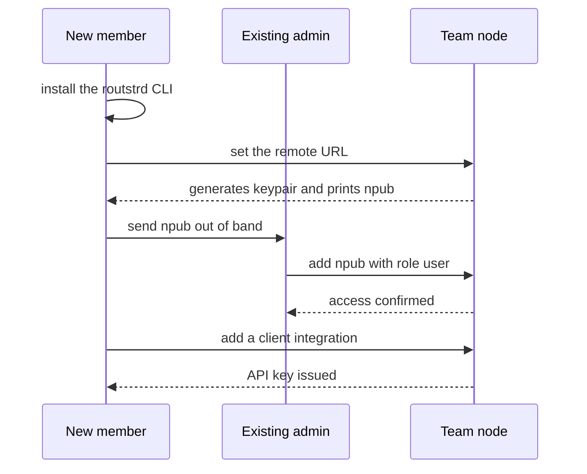

# Team Members

Access to a team node is an entry in one table: `routstr_auth_npubs`. Each row holds a Nostr pubkey, an optional display name, and a `role` of `admin` or `user`. Adding someone grants access; deleting their row revokes it.

There are no passwords, no invite links, and no email addresses. Identity is a Nostr keypair that each person generates on their own machine.

---

## The invite loop

A new member does the first two steps themselves; an existing admin does the third.



### 1. The member installs the CLI and connects

```bash
bun i -g routstrd
routstrd remote https://team.example.com
```

`routstrd remote` writes the node URL into `~/.routstrd/config.json` and, **only if no Nostr identity exists yet**, generates one and prints the npub:

```text
Remote daemon URL set to: https://team.example.com

A new Nostr identity has been generated for remote authentication.
Your npub: npub1abc...xyz
You can view it in the config file at: /home/bob/.routstrd/config.json
```

If you already had an identity, it is reused and no npub is printed — run `routstrd remote` with no arguments to display the current node and identity.

!!! tip "Your npub is not a secret"
    It is a public key and safe to paste into a team chat. The corresponding `nsec` lives in `~/.routstrd/config.json` and **is** a secret: it signs every management request. Never share it, and treat any host that has it as holding that member's credentials.

### 2. The member sends their npub to an admin

Out of band — chat, ticket, whatever. There is no self-service join.

### 3. An admin adds them

```bash
routstrd npubs add npub1abc...xyz --name "Bob"
```

The role defaults to `user`. The new member can now run inference and manage their own clients. To make them an admin, pass `--role admin` (or promote later).

---

## Bootstrap: the first admin

A brand-new node has an empty table, which is a special case: `POST /npubs` is accepted **without authentication** so that someone can claim the node.

```bash
routstrd remote https://team.example.com
routstrd npubs register --name "Alice"
```

`npubs register` is deliberately narrow — it refuses to do anything if any npub already exists:

```text
Admin npubs already configured (3). Ask your admin to add your npub.
 Your npub: npub1...
```

So `register` only ever works once per node. After that, `npubs add` is the command, and it requires admin NIP-98 auth.

!!! warning "Claim the node during install"
    Between the app becoming healthy and the first `npubs register`, the node is unclaimed — anybody who reaches the URL can become admin. See [Deploy on Cloudron](deploy-cloudron.md#bootstrap-the-first-admin).

---

## Command reference

All of these talk to the auth proxy over NIP-98, so the caller must be a registered npub, and the mutating ones require the `admin` role.

| Command | Role needed | Notes |
|---|---|---|
| `routstrd npubs list` | any registered | Shows role and name for everyone, and marks your own row with `→ you`. |
| `routstrd npubs register` | none, **once** | Only succeeds while the table is empty. |
| `routstrd npubs add <npub>` | admin | Accepts `npub1...` or a 64-char hex pubkey. `--role admin\|user` (default `user`), `--name`. |
| `routstrd npubs update <npub>` | admin | `--role` and/or `--name`. Passing `--name ""` clears the name. |
| `routstrd npubs delete <npub>` | admin | Revokes access. |

Names are trimmed and capped at 64 characters.

`routstrd npubs list` output looks like this:

```text
Npubs (3):
- npub1qqq...4f2 [admin] "Alice" → you
- npub1xxx...9k7 [user] "Bob"
- npub1zzz...3md [user]
```

If your own npub is missing from the list, the CLI tells you whom to send it to:

```text
Your npub is not in the npub list. Ask an admin to add your npub:
  npub1yyy...0pl
```

## Underlying HTTP API

The CLI is a thin wrapper over four endpoints on the auth proxy. Useful for scripting or a custom onboarding form.

| Method | Path | Auth | Body |
|---|---|---|---|
| `GET` | `/npubs` | any registered npub | — |
| `POST` | `/npubs` | none **if the table is empty**, otherwise admin | `{ "npub": "npub1..." }` or `{ "pubkey": "<hex>" }`, plus optional `role` and `name` |
| `PATCH` | `/npubs` | admin | `{ "npub": "npub1..." }` plus `role` and/or `name` (`name: null` clears it) |
| `DELETE` | `/npubs/<npub-or-pubkey>` | admin | — (also accepts `/npubs?npub=...`) |

Responses:

- `GET /npubs` returns `{ "npubs": [ { "npub": "...", "name": "...", "role": "admin" } ] }`.
- Adding a pubkey that is **already registered** returns `409` rather than silently succeeding; use `PATCH` to change an existing entry.
- Every mutation is performed by, and recorded against, the requesting admin.

!!! note "Revocation is immediate"
    Roles and removals are read from the database on **every request** with no caching layer. Deleting an npub stops that member's management access on their next request. Their **API keys are a separate matter** — see below.

---

## What revocation does and does not do

Both halves of offboarding are separate, and only the first is available through the normal member-facing API.

**1. Management access — revoked by deleting the npub.**

```bash
routstrd npubs delete npub1abc...xyz
```

Roles and rows are read from the database on **every request** with no caching layer, so the next NIP-98 request from that key is rejected immediately.

**2. Inference keys — a separate, manually managed thing.**

The Bearer path validates an `sk-...` key by looking it up in the client records and nothing else. Deleting an npub does **not** touch those rows, so an offboarded member's existing API keys keep working for inference until the client itself is deleted.

Here the proxy's scoping matters: `/clients`, `/clients/add`, and `/clients/delete` are **strictly owner-scoped** — the proxy filters and authorises by the calling npub. Being an `admin` does not grant access to a *colleague's* client records through those endpoints. So the realistic offboarding paths are:

- **Have the member delete their own clients** before you remove their npub: `routstrd clients list`, then `routstrd clients delete <id>`.
- **Or do it on the node itself.** Inside the container the CLI talks to the daemon directly on loopback, where there is no auth layer and therefore no ownership filter:

```bash
cloudron exec --app routstr.example.com
routstrd clients list            # every client on the node, all owners
routstrd clients delete <id>
```

On the node, client IDs appear **with** their owner suffix (`my-laptop-4f2x9k7`) — see [Connecting Clients](clients.md). That suffix is exactly what tells you which member a client belongs to.

!!! danger "Removing an npub is not the same as revoking access"
    If you skip step 2, a departed member's agents continue to consume the team's wallet. Always pair `npubs delete` with deleting their client records.

---

## Next steps

- [Connecting Clients](clients.md) — get each member's agents talking to the node.
- [Usage and Model Policy](usage-and-policy.md) — see what each person is spending.
