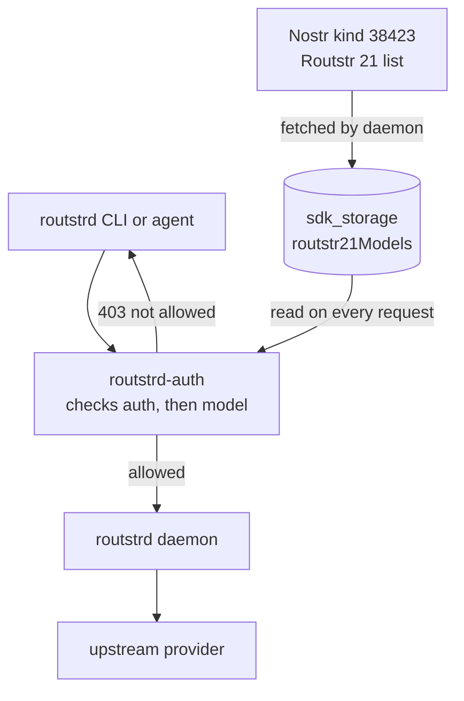

# Usage and Model Policy

Two things a team admin cares about: **who is spending what**, and **which models the team may use**. The first is always tracked; the second is an opt-in policy.

---

## Usage tracking

Every request is attributed to the **client** that made it, and every client is owned by exactly one member. That chain is what produces per-person reporting.

### As a member

```bash
routstrd usage      # your own usage summary
routstrd top        # interactive TUI, alias for 'monitor'
routstrd balance    # wallet balance and status
```

### As the operator, on the node

The most complete view is the TUI, run inside the container:

```bash
cloudron exec --app routstr.example.com
routstrd top
```

The **clients** tab shows individual usage, and because each client ID carries the **last 7 characters of its owner's npub**, you can tell teammates apart at a glance even when several of them named their client `my-laptop`:

```text
my-laptop-4f2x9k7    1,204 req     $3.18
my-laptop-9k7qp2       881 req     $2.07
ci-runner-3md1zz       412 req     $0.94
```

Run from the node, this view is **not** filtered to any one member — that is the difference between the CLI on the box and the same CLI on a laptop.

### Over HTTP

| Method | Path | Auth | Scope |
|---|---|---|---|
| `GET` | `/usage` | NIP-98 from a registered npub | The **caller's** usage only |
| `GET` | `/usage/summary` | NIP-98 from a registered npub | The **caller's** usage only |

The proxy forces the scope: it takes the authenticated npub and sets the `npub` query parameter before forwarding to the daemon, so the daemon returns that member's records. There is no query parameter you can pass to widen it — a member cannot read a colleague's usage through the API. Aggregate visibility requires access to the node itself.

---

## The wallet

The team shares **one node wallet**. Funding it is a single action rather than N personal top-ups, and that is one of the main reasons to run a team node.

| Endpoint | Required role |
|---|---|
| `/wallet/status`, `/wallet/balance`, `/wallet/mints`, `/wallet/mints/info` | any registered npub |
| `/wallet/receive/cashu`, `/wallet/receive/bolt11` | any registered npub |
| `/wallet/send/cashu`, `/wallet/send/bolt11` | **admin only** |

Reading the balance and receiving funds are open to every registered member; **moving funds out is admin-only.** Note the consequence: members can see the team's total balance but cannot withdraw from it. API keys can do none of this.

Funding, mint management, and payment semantics are the daemon's domain and are documented in the provider and client guides rather than repeated here.

!!! warning "Usage is attributed, not isolated"
    There is no per-member balance and no spending cap on this layer. A member's clients spend from the same wallet everyone else does. If you need hard limits, they are not enforced here — track the usage view and manage access accordingly.

---

## Model allowlist

The proxy can restrict the team to the **Routstr 21 model list**. This is **disabled by default**; enable it with:

```bash
ROUTSTRD_AUTH_MODEL_ALLOWLIST=true
```

When enabled, a request naming a model outside the list is rejected with `403` **before it reaches the daemon**, so no tokens are spent. When disabled, every model passes through untouched.

### How it works



1. The **daemon's** SDK fetches the Routstr 21 list from Nostr (kind `38423` events) and stores it in the shared SQLite database under the `sdk_storage` table, key `routstr21Models`.
2. The **proxy** reads that key from the same database. It has **zero Nostr dependency** — no relay connections, no keys of its own for this purpose.
3. The value is read fresh on every request, with no caching, so a list update takes effect immediately.

Because the proxy shares the daemon's database, this costs a single indexed key lookup — typically under a millisecond.

### What is and is not checked

| Request | Checked |
|---|---|
| `POST` / `PUT` / `PATCH` with a JSON body containing `model` | yes |
| `GET` requests, including `/models` and `/v1/models` | no — public paths, forwarded immediately |
| Management endpoints (`/npubs`, `/clients`, `/usage`) | no — routed to their own handlers before this check |
| Non-JSON bodies | no — no `model` field can be extracted |
| Requests with no `model` field | no — forwarded, and the upstream produces the error |

Model IDs are compared **case-sensitively**, matching how they are stored in the list.

### Fail-open behaviour

If `routstr21Models` is absent — typically because the daemon has not bootstrapped it yet — the proxy **fails open and allows every model**. This is deliberate: the alternative is that a fresh node blocks all traffic until Nostr bootstrapping completes. The trade-off is that an allowlist can be silently ineffective early in a node's life, so verify it after enabling:

```bash
# confirm the daemon has populated the list
cloudron exec --app routstr.example.com
sqlite3 /app/data/routstrd/routstr.db \
  "SELECT substr(value,1,120) FROM sdk_storage WHERE key = 'routstr21Models';"
```

If that returns nothing, the allowlist is not yet meaningful.

### Performance note

When enforcement is enabled, the proxy buffers `POST`/`PUT`/`PATCH` request bodies so it can inspect the `model` field. That is a small latency cost on request upload. **Response streaming is unaffected** — SSE and LLM token streams pass through unbuffered, and the proxy explicitly tells intermediaries not to buffer. When the allowlist is disabled, the body is not buffered at all.

---

## Keeping the model list current

The list is updated by the daemon, not the proxy:

```bash
routstrd clients --manual-refresh               # refresh now
routstrd clients --disable-automatic-refresh    # stop the scheduled job
routstrd clients --enable-automatic-refresh     # resume it
```

If the scheduled refresh job is disabled and nobody runs a manual refresh, the allowlist enforces a **stale** list — and would eventually stop matching newly approved models.

---

## Next steps

- [Security Model](security.md) — the full endpoint-by-endpoint auth matrix.
- [Troubleshooting](troubleshooting.md) — including "why am I getting a 403".
